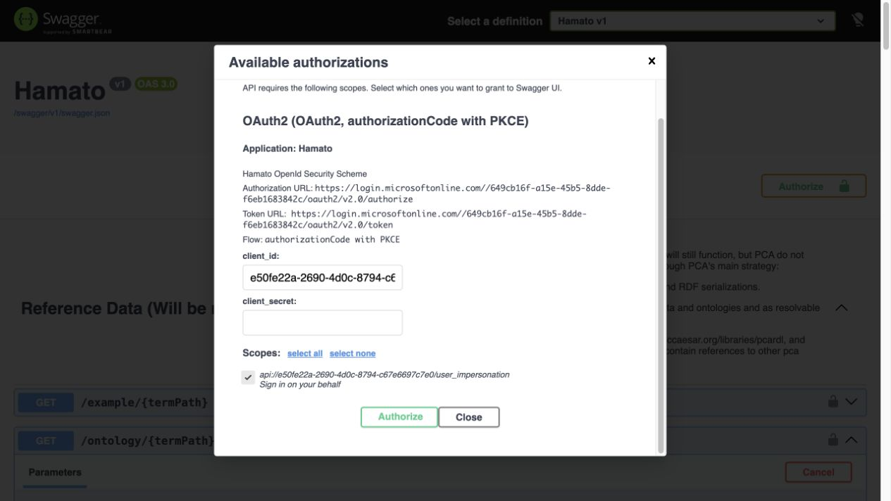
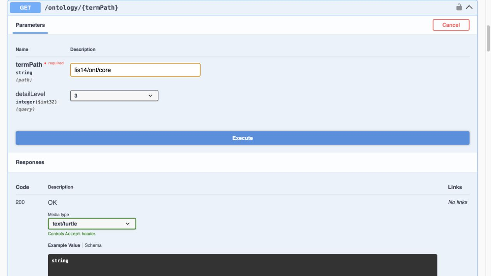

PCA uses Microsoft identity and OAuth 2.0 to protect its APIs. Authentication establishes
the identity of a person or registered application. Authorization then checks whether
that identity has the PCA role required for the requested action.

## Role-based authorization

| Request | Required access |
|---|---|
| Interactive Libraries and Search, and HTML content pages | No PCA role |
| Search API and machine-readable retrieval, including JSON, symbols, and IMF SHACL | Reader or Creator |
| Create or update supported content | Creator |
| Submit a Draft | Creator or Reviewer |
| Review submitted content | Reviewer |

## Try an endpoint in Swagger UI

The quickest way to make an authorized request as yourself is the
[PCA Swagger UI](https://posccaesar.org/swagger/). Select **Authorize**, tick the
`user_impersonation` box under **Scopes**, select **Authorize** in the dialog, and
complete the Microsoft sign-in. Swagger already has the relevant client, tenant,
redirect, and delegated-scope settings for the deployed platform, so you do not need to
find or enter those values yourself.



*Select the delegated scope before continuing to Microsoft sign-in.*

### Fetch the IDO core ontology

After sign-in returns you to Swagger:

1. Expand **Reference Data**, then expand `GET /ontology/{termPath}`.
2. Select **Try it out**.
3. Enter `lis14/ont/core` for `termPath`.
4. Select `3` for `detailLevel` to request the complete ontology.
5. Select `text/turtle` as the response media type.
6. Select **Execute**. Swagger sends the bearer token and calls the environment where
   that Swagger page is hosted.



*The IDO core request uses the ontology path, complete detail level, and Turtle
representation.*

Swagger is a convenient test interface, but it is not a complete endpoint catalogue.
Some search and dereferencing routes are intentionally omitted. Use the
[endpoint reference](api-reference.md) to choose a supported route, then use Swagger for
the request schemas it exposes.

## Authorize a user in a registered client

Use delegated user authorization when a person is actively using the application and
the action should be recorded under that person's permissions. The client must have a
Microsoft Entra application registration, a registered redirect URI, delegated access
to the PCA API, and the required consent. Contact PCA before implementation to confirm
the registration and access arrangement.

1. Ask PCA to provision the user and the required Reader, Creator, or Reviewer role.
2. Register the client and its redirect URI, and configure the delegated PCA API
   permission and consent in coordination with PCA.
3. Configure the client with the Microsoft identity values supplied or approved by PCA.
4. Sign the user in with OAuth 2.0 Authorization Code with PKCE.
5. Request the delegated `user_impersonation` scope.
6. Send the resulting **access token** with each PCA API request:

```http
Authorization: Bearer <access-token>
```

The token must be an access token intended for the PCA API. An ID token only describes
the signed-in session and must not be sent as the API bearer token.

## Authorize a registered application or service

PCA also supports registered applications that need to call the API without an active
user—for example, an approved integration or background service. Contact PCA before
implementation so the application can be registered and given the correct role. PCA
will provide the environment-specific details, including the tenant and token endpoint,
client ID, credential or certificate requirements, API application ID URI or scope, and
the allowed access.

The principle is the same as for a user: obtain an OAuth access token and send it as a
bearer token. The difference is that the application authenticates with its own
credential and requests the API's `.default` permissions. A client-secret flow has this
general shape. Here, `<protected-secret-file>` is populated by approved secret-management
tooling and is kept outside source control:

```bash
curl --request POST \
  --url 'https://login.microsoftonline.com/<tenant-id>/oauth2/v2.0/token' \
  --header 'Content-Type: application/x-www-form-urlencoded' \
  --data-urlencode 'client_id=<application-client-id>' \
  --data-urlencode 'client_secret@<protected-secret-file>' \
  --data-urlencode 'scope=<PCA-API-application-ID-URI>/.default' \
  --data-urlencode 'grant_type=client_credentials'
```

Read the `access_token` from the response and use it for a PCA request:

```bash
curl --header 'Authorization: Bearer <access-token>' \
  --header 'Accept: application/json' \
  'https://posccaesar.org/<supported-resource-path>'
```

Do not copy a personal browser token into a service. A person's role does not transfer
to an application identity; PCA assigns and governs the application's access separately.
Keep the client secret or private key in an approved secret store, not in source code or
the command history.

## Handle tokens safely

- Request the least privilege and shortest practical lifetime.
- Acquire a new token when the current token expires; do not treat access tokens as
  permanent API keys.
- Keep tokens out of URLs, logs, issue reports, and source control.
- Treat `401 Unauthorized` as missing, invalid, or expired authentication.
- Treat `403 Forbidden` as an authenticated caller that lacks required authorization.
- Correlate failures with the response `traceId` when present, without sharing the token.

## See also

- [Find and retrieve data through the API](get-content-through-the-api.md)
- [API endpoint and error reference](api-reference.md)
- [Roles, access, and content states](../roles-access-and-content-states.md)
