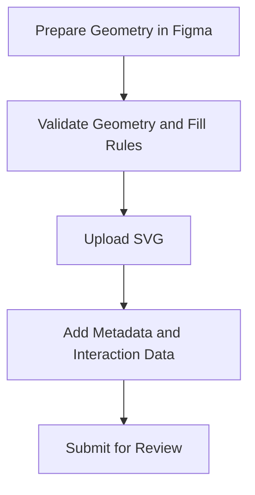

This guide explains the end-to-end use of the Digital Symbol Editor.

## What this workflow is for

Use the Digital Symbol Editor when you want to propose a new engineering symbol that can be reviewed, published, and reused in a richer digital context than a simple image file allows.

## What makes this workflow special

This workflow combines two things:

- symbol geometry preparation
- platform submission and review

That means there are usually two parts to the work:

1. prepare a compliant geometry-only SVG
2. upload it together with the metadata and interaction information the platform needs

## Recommended reading order

1. Read [Digital Symbol Editor Figma Workflow](digital-symbol-editor-figma-workflow.md)
2. Continue to [Digital Symbol Editor Submission Workflow](digital-symbol-editor-submission-workflow.md)
3. Finish with [Digital Symbol Editor Best Practices](digital-symbol-editor-best-practices.md)

## End-to-end path

## See also

- [Digital Symbol Editor Figma Workflow](digital-symbol-editor-figma-workflow.md)
- [Digital Symbol Editor Submission Workflow](digital-symbol-editor-submission-workflow.md)
- [Digital Symbol Editor Best Practices](digital-symbol-editor-best-practices.md)
