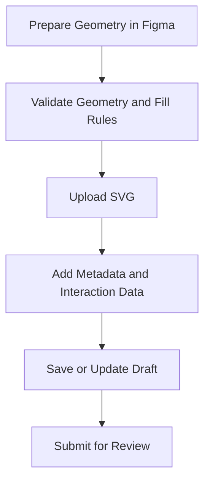

Use the Engineering Symbol Editor when a symbol must be discoverable, retrievable as
data, reviewed, and reusable in engineering applications—not merely stored as an image.
The workflow turns geometry-only SVG into a governed resource with a stable IRI,
metadata, a centre of rotation, and optional connection points.

## Recommended reading order

1. [Prepare SVGs with Figma](digital-symbol-editor-figma-workflow.md)
2. [Check geometry and quality](digital-symbol-editor-best-practices.md)
3. [Submit an engineering symbol](digital-symbol-editor-submission-workflow.md)

## How the pieces fit together

```mermaid
flowchart TD
    Prepare[Prepare Geometry in Figma]
    Validate[Validate Geometry and Fill Rules]
    Upload[Upload SVG]
    Describe[Add Metadata and Interaction Data]
    Draft[Save or Update Draft]
    Submit[Submit for Review]

    Prepare --> Validate --> Upload --> Describe --> Draft --> Submit
```

Prepare and validate the SVG first, then upload it and add the semantic information.
Saving creates a Draft that you can inspect and edit; submitting starts the
review process.

## API access

The interactive editor requires Creator. API authoring uses `POST
/esl/engineeringSymbols` and Draft updates use `PUT
/esl/engineeringSymbols?iri=<encoded-Draft-IRI>`. A Reader or Creator can retrieve
symbols from `GET /esl/engineeringSymbols` as Turtle, JSON-LD, or JSON.

The [symbol submission guide](digital-symbol-editor-submission-workflow.md) explains the
equivalent Creator API and the shared Draft lifecycle. Reader and Creator clients can
retrieve symbols as Turtle, JSON-LD, or JSON after authenticating. A submitted symbol
is locked against Creator changes and cannot be withdrawn to Draft through the
documented workflow.
