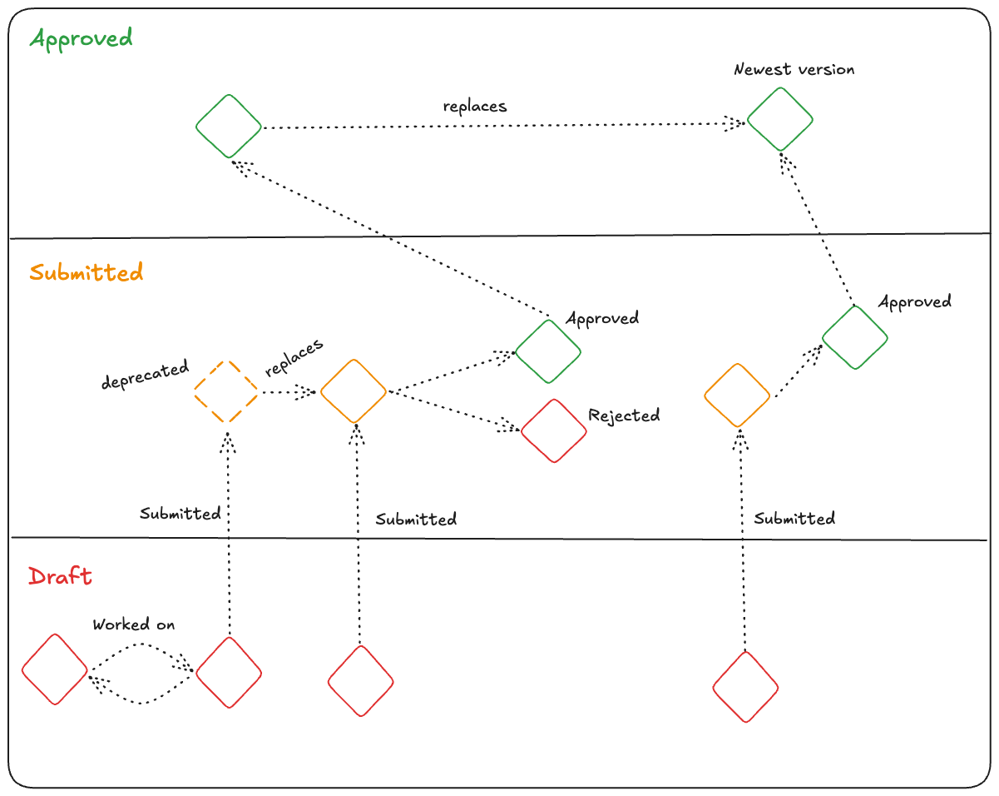

# Versioning

The process of versioning a resource is complex, with numerous scenarios and use cases to consider when determining the best strategy. For instance, should contributors be allowed to modify a resource while it is awaiting approval? Is it beneficial to retain the history of resources that were submitted but ultimately rejected? After an in-depth workshop, PCA has concluded an approach to resource versioning, which is outlined as follows:

> All resources that have been added to the PCA library by Draga before **XX/XX/XXXX** are considered as Submitted resources.

> A resource in PCA’s library will have one of these five different statuses in any given time:
>
> - Draft
> - Submitted
> - Deprecated
> - Approved
> - Rejected

## Draft

PCA currently does not offer a dedicated platform for collaboration on IMF types. However, it is part of the long-term development plan. This platform will allow users to iterate on their IMF types before submitting them for approval and share drafts with selected collaborators. Drafts will remain private until they are officially submitted to the library.

## Submitted

This status indicates that a resource has been submitted for review. The resource is considered final and is accessible to all users in the library. It will then be evaluated by SMEs and either approved or rejected based on their review.

## Deprecated

If a contributor needs to add more metadata to an already Submitted type, they can replace the existing submission. This action changes the status of the original type to Deprecated, while the updated type is assigned the Submitted status and enters the approval process.

## Approved

An approved resource in the library. It can be replaced with new data that is sent for approval with Submitted status. When an Approved resource is replaced, the original version is retained in the library for reference.

## Rejected

A resource with the Rejected status is one that has been submitted but did not pass the approval process. All rejected resources are preserved in the library for reference.

## Graphic representation of versioning process

